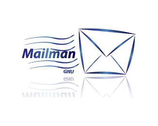

---
layout: default
title: Mitmachen
weight: 2
---        

# Mitmachen

Ihr möchtet dabei sein, im Austausch mit anderen stehen und vielleicht 
aktiv etwas beitragen? Dann registriert Euch!

## Mailing Liste{: height="60em"}

Erhaltet Informationen aus unserer Gemeinschaft und informiert selbst 
über Neuigkeiten, Stellenangebote und Möglichkeiten der Zusammenarbeit.
Mit dem folgenden Formular meldet Ihr Euch auf der Mailingliste 
liste@de-RSE.org an.

<form method="POST" action="https://ml-cgn04.ispgateway.de/mailman/subscribe/liste_de-rse.org">
  

    <input name="email" value="" type="email" placeholder="Emailadresse eingeben">
    <button type="submit" class="btn btn-primary">Anmelden</button>
  

</form>
<form method="POST" action="https://ml-cgn04.ispgateway.de/mailman/options/liste_de-rse.org">
  

    <input name="email" value="" type="email" placeholder="Emailadresse eingeben">
    <input name="unsubconfirm" type="hidden" value="1">
    <button type="submit" name="unsub" class="btn btn-primary">Abmelden</button>
  

</form>

Bitte beachtet, dass die Mailing Liste im Moment nur Mails mit einer Größe von 
40kB akzeptiert, das sollte für Text ausreichend sein. Wer gern auf Dokumente 
und andere Anhänge hinweisen möchte, kann die URL Adresse angeben und falls nötig 
vorher das Material an einem anderen Ort hochladen und so zur Verfügung stellen.

## Slack{: height="60em"}

Für Diskussionen bitte nicht die Mailing Liste nutzen, sondern Slack 
<https://de-rse.slack.com/>. Den Zugang 
bekommt Ihr von Stephan, Frank oder Martin (siehe unten) - einfach per Mail anschreiben.

Slack-Benutzer dürfen andere einladen.

Mitglieder folgender Domains können alternativ auch den [Sign-Up-Link](https://join.slack.com/t/de-rse/signup) benutzen. 



## Monatlicher Call

Beim Dezember 2016 Call der deutschsprachigen 
[OKF-Arbeitsgruppe Open Science](http://www.ag-openscience.de/)
wurde diskutiert, ob wir den monatlichen Call 
mit der de-RSE Initiative Anfang 2017 zusammenlegen können. Beide Themen, Open Science 
und Research Software Engineers, hängen eng zusammen, verfolgen Ziele mit einer 
gemeinsamen Schnittmenge und adressieren einen ähnlichen Kreis von Interessenten.

Auch wenn für die recht junge de-RSE Initiative ebenfalls ein regelmäßiger Call angedacht 
ist, werden beide Calls bis auf weiteres zusammengelegt. 
Danach schauen wir dann, wie wir weitermachen.

Termine für die monatlichen Calls findet Ihr [hier](https://pad.okfn.de/p/openscience-ag-master-pad).

## Blog

Der Blog auf der Webseite wird von der Community gemeinschaftlich gestaltet.
Deine Ideen, Themen und Beiträge auf Deutsch, English, oder beidem sind sehr willkommen!
In der `README` findest du eine Anleitung wie Du eine Vorschau der Seite auf deinem eigenen Rechner bekommen kannst.

# Kontakt

Wer mehr über Hintergründe, Ziele und Aktivitäten wissen möchte oder Fragen zu 
anderen Themen hat, kann sich einfach über die Mailing Liste liste@de-RSE.org melden.

Sollte jedoch der persönliche Kontakt gewünscht sein, dann können folgende Personen 
gern als Ansprechpartner kontaktiert werden.

Martin Hammitzsch\\
Helmholtz-Zentrum Potsdam - Deutsches GeoForschungsZentrum GFZ\\
<http://www.gfz-potsdam.de/mitarbeiter/martin-hammitzsch/>\\
<https://twitter.com/mrtnhmtz>

Frank Löffler\\
Institut für Informatik, Friedrich-Schiller-Universität Jena\\
<https://www.cct.lsu.edu/~knarf/>  

Stephan Janosch\\
Max-Planck-Institut für Molekulare Zellbiologie und Genetik\\
<https://www.mpi-cbg.de/de/institut/staff-search>\\
<https://twitter.com/StephanJanosch>

Wer gern als weiterer Ansprechpartner dabei sein möchte, 
meldet sich einfach bei den oben genannten Ansprechpartnern.
